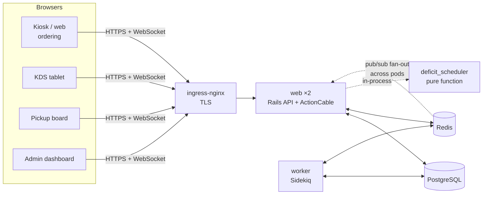
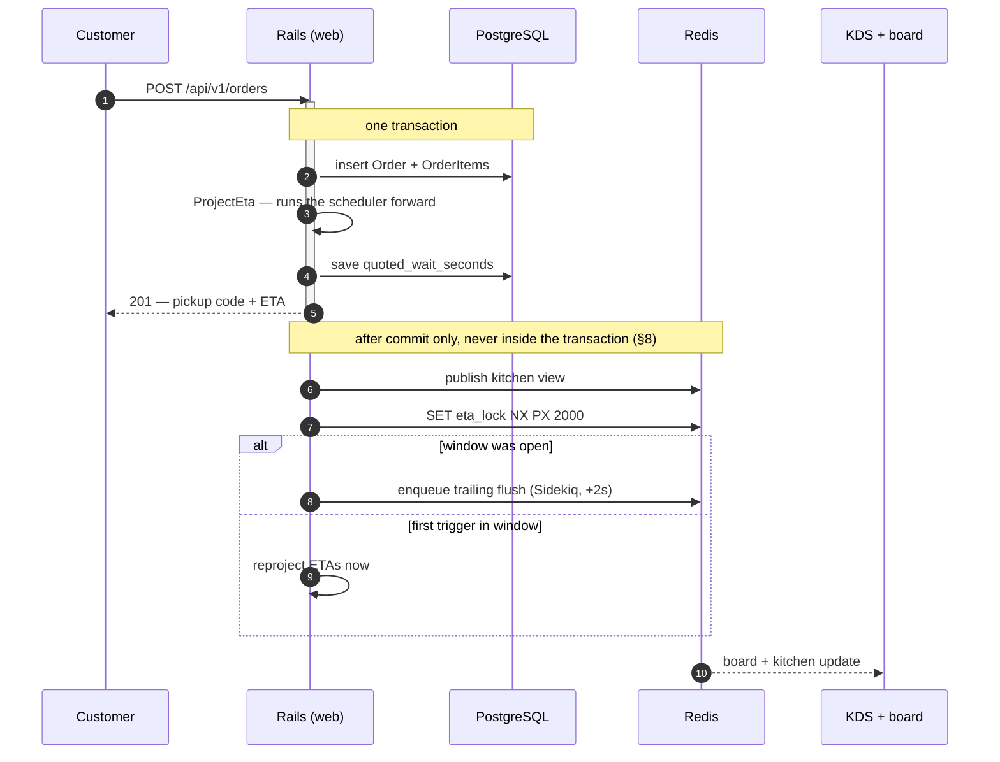
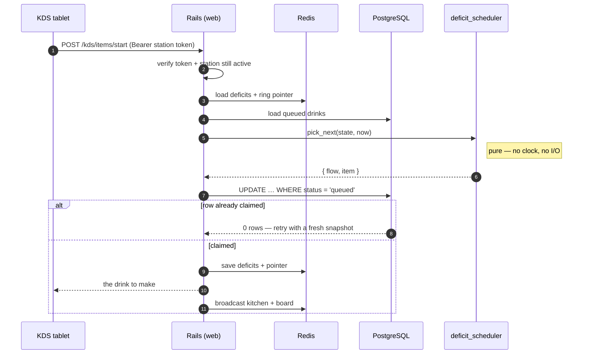
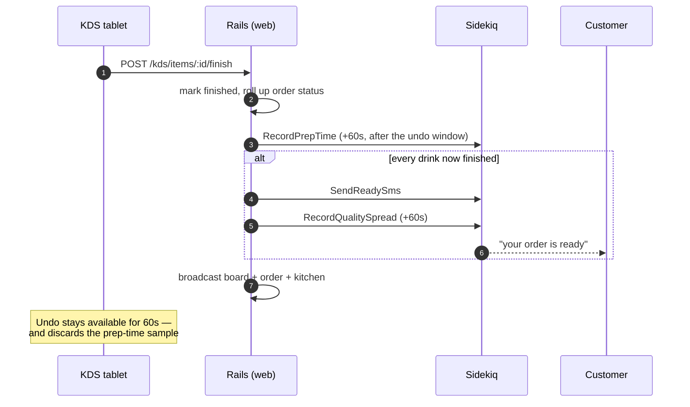
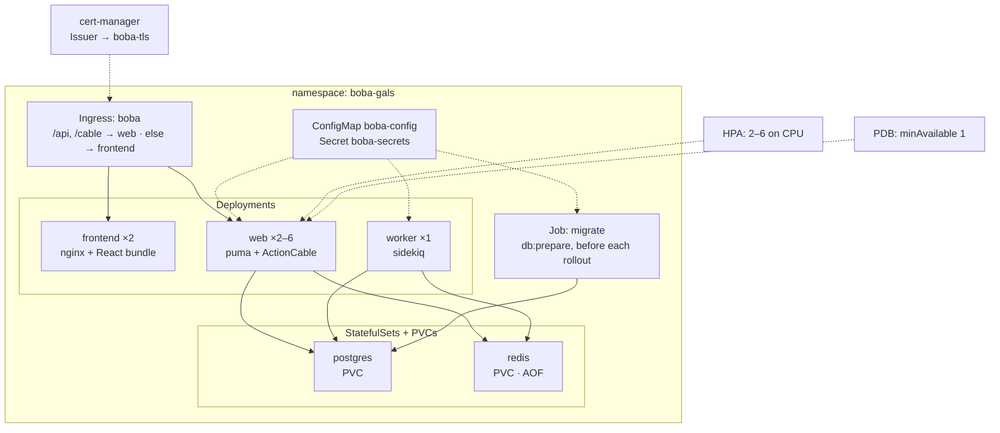

# Boba Gals

Ordering and kitchen scheduling for a boba tea shop.

The central constraint: **a large order must not block small orders.** The unit of
work is a *drink*, not an order, and drinks are scheduled by deficit round robin —
so a customer ordering one drink behind a 15-drink catering order waits roughly one
drink's time, not fifteen.

**[`DESIGN.md`](DESIGN.md) is the specification.** It is section-numbered (`§6.2`,
`§14.4`, …) and is the source of truth for every decision here; this file is only
how to run it.

## Stack

| | | Why this one |
|---|---|---|
| **Ruby 3.4** / **Rails 8** | API only — no views, no asset pipeline | The frontend is a separate build; Rails serves JSON and ActionCable |
| **React 19** + **TypeScript** | Kiosk, web ordering, KDS, pickup board, admin dashboard | One bundle, five surfaces (§9.3). Strict mode, function components only |
| **PostgreSQL 16** | Orders, drinks, menu, learned prep times | Partial indexes carry the hot queries; `SKIP LOCKED` history in §12 step 2 |
| **Redis 7** | Scheduler deficits + ring pointer, ETA debounce lock, ActionCable pub/sub, Sidekiq queues | **Load-bearing, not a cache.** Two `web` pods from day one, so coordination cannot live in process (§14.4) |
| **Sidekiq** | ETA recomputes, prep-time learning, quality sweeps, ready SMS | Rails 8's Solid defaults are deliberately *not* used — Redis is already here (§14.1) |
| **Kubernetes** (kind locally) | 2× `web`, 2× `frontend`, `worker`, Postgres, Redis, ingress-nginx | Hand-written manifests + Kustomize overlays; every feature ships through the cluster (§12 step 4) |
| **Vite** / **Vitest** / **oxlint** | Frontend build and test | |
| **RSpec** / **FactoryBot** / **SimpleCov** / **mutant** | Backend test and coverage | Mutation testing is scoped to the scheduler gem — 100% coverage on a pure function proves little on its own |
| **Prometheus** / **Grafana** | Business gauges, not just framework metrics | Queue depth, wait percentiles by order size, ETA error (§15) |

The scheduler itself is a **[path gem with zero runtime dependencies](gems/deficit_scheduler/)**
that does not load Rails. That is the boundary: it cannot quietly reach for
`Time.current` or an ActiveRecord model, because doing so would mean adding a
dependency on purpose (ADR-0033).

## How it fits together



Redis carries four unrelated jobs — scheduler state, the ETA debounce lock,
ActionCable pub/sub, and Sidekiq's queues. Only the last is durable; the rest are
reconstructible by design (§6.5), which is why it runs with AOF but the scheduler
tolerates a cold start.

## Key flows

**Placing an order.** The quote a customer sees is produced by running the *real*
scheduler forward over the current queue — not a `total_work / stations` estimate —
so it stays correct when scheduler parameters change (§7.1).



**Making a drink.** Which drink comes next is decided by a pure function over a
snapshot, with **no database lock held** — the claim is a single conditional
`UPDATE`, so two tablets racing resolve on the row, not on a mutex (§6.2).



**Finishing it.** `finished` is terminal — a bad drink becomes a *new* row, never an
edit — with one exception: a 60-second undo for a mistap, which is why the prep-time
sample is deferred rather than recorded inline (§5.2, ADR-0019).



## Setup

Requires [Docker](https://docs.docker.com/get-started/) and
[mise](https://mise.jdx.dev/) (or any version manager that reads `.ruby-version`
and `.node-version`).

```bash
mise install                 # Ruby 3.4.10, Node 24.19.0
bundle install
npm --prefix frontend install
lefthook install             # commit-msg + pre-commit + pre-push hooks

docker compose up -d postgres redis
bin/rails db:prepare
```

If `ruby -v` still reports the system Ruby, mise isn't activated in your shell:

```bash
echo 'eval "$(mise activate zsh)"' >> ~/.zshrc                          # interactive shells
echo 'export PATH="$HOME/.local/share/mise/shims:$PATH"' >> ~/.zprofile # hooks and editors
```

## Running

```bash
docker compose up            # postgres, redis, api :3000, worker, vite :5173
```

Adding a gem needs `bundle install` **inside** the container, not a rebuild:

```bash
docker compose run --rm --no-deps api bundle install
```

Gems live in a named volume (`bundle:/usr/local/bundle`) that is mounted over the
path the image installed them to, so `docker compose build` alone leaves the
container booting against the old lockfile.

`api` and `worker` run the same image with different commands — the production
topology (§14.1), rehearsed locally so it isn't discovered at deploy time.

## Kubernetes

Everything after §12 step 4 ships through the cluster — that repetition is where the
Kubernetes learning actually happens, and it is why CI stands a real cluster up on
every push rather than trusting the manifests to be right.



Three details that are easy to get wrong and are load-bearing here:

- **`web` never migrates on boot.** The `migrate` Job owns that, and `web` blocks on an
  init container until the schema it expects is present (§14.2, ADR-0037).
- **Two `web` pods from the first deploy**, so in-process state fails fast rather than
  in production. The HPA's floor keeps that true while scaling (§14.2, ADR-0027).
- **`web` and `worker` are the same image**, differing only in command — the production
  topology, rehearsed by `docker compose` locally.

```bash
bin/k8s-up                   # kind cluster + ingress-nginx + cert-manager + build, load, deploy
bin/k8s-down --app           # delete the app, keep the cluster (fast redeploy)
bin/k8s-down                 # delete the cluster entirely
bin/k8s-down --images        # ...and remove the locally built boba-*:dev images
```

The shop comes up at **https://boba.localtest.me:8443** — board at `/board`.
`localtest.me` resolves to 127.0.0.1, so that is a real hostname with a real
certificate and no `/etc/hosts` entry. Plain http is not served at all (§14.5).

The certificate is signed by a CA the cluster mints itself, so browsers warn.
**Trusting it is optional** — clicking through the warning leaves you on an
`https` origin, so the admin cookie and the websocket both work either way.
`bin/k8s-up` writes the CA to `tmp/boba-ca.crt` and prints the command for your
platform, plus the `curl --cacert` form for scripts, which needs no `sudo`.

None of this applies to `docker compose` above, which is the shorter path to a
running shop and stays on plain http at `localhost:5173`.

`bin/k8s-up` is idempotent: re-run it to redeploy after a code change. Both
teardown modes destroy the dev database; the migrate Job re-seeds on the next
bring-up (ADR-0007).

Requires [kind](https://kind.sigs.k8s.io/) and `kubectl`, and a Docker VM with
room for the whole stack — two `web` pods, two `frontend` pods, a worker,
Postgres, Redis and ingress-nginx:

```bash
colima stop && colima start --cpu 6 --memory 8
```

Colima's 2 GiB default is not enough, and it fails twice over: pods first sit
`Pending` with `Insufficient memory`, and once requests are small enough to
schedule they get `OOMKilled` instead, because the limits then oversubscribe
physical memory. Delete the cluster before resizing the VM
(`bin/k8s-down`), or it comes back half-broken.

CI stands the same cluster up on every push and drives it — order placed
through the ingress, probes checked, Redis pulled out from under the pods — so a
broken manifest fails there rather than on your machine.

## Tests

```bash
bin/rspec                    # full suite; coverage gates enforced
bin/rspec spec/requests      # partial run; gates skipped
COVERAGE=0 bin/rspec         # no instrumentation, for spiking
bundle exec rubocop

npm --prefix frontend run test:run
npm --prefix frontend run lint
npm --prefix frontend run typecheck
```

The scheduler gem carries its own suite and its own gate:
`cd gems/deficit_scheduler && bundle exec rspec`. Gates, conventions and the §11 checklist
are in [`docs/testing.md`](docs/testing.md).

Check the frontend with `run typecheck` (`tsc -b`), never a bare `npx tsc --noEmit` — build
mode walks the project references and so typechecks the test project; the bare form silently
does not.

## Where things live

Start here when you know *what* you want to change but not *where*.

| I want to change… | Look at | Spec |
|---|---|---|
| Which drink is made next | `gems/deficit_scheduler/lib/` — `pick_next` and its four boosts | §6 |
| The scheduler's tuning knobs | `Store#effective_scheduler_config` → `BuildSchedulerConfig` | §6.6 |
| The wait a customer is quoted | `app/services/project_eta.rb` | §7.1 |
| When ETAs recompute, and how often | `app/services/recompute_eta.rb` — Redis `SET NX PX` debounce | §7.2 |
| What a barista sees / claims | `app/services/claim_next_drink.rb`, `frontend/src/kds/` | §9.4 |
| The pickup board | `app/services/board_view.rb`, `frontend/src/board/` | §9.2 |
| Ordering, cart, checkout | `frontend/src/order/` | §9.3 |
| The simulator and its experiments | `app/simulator/` | §10 |
| The admin dashboard | `frontend/src/dashboard/` | §10.6 |
| Anything about the cluster | `k8s/base/`, overlays in `k8s/overlays/{dev,prod}` | §14 |

| Also | |
|---|---|
| `docs/adr/` | **Why** something is the way it is, when DESIGN.md doesn't say. Immutable — superseded, never edited |
| `docs/testing.md` | Test conventions, coverage gates, the §11 checklist, and what a simulation spec may cost |
| `docs/api/` | OpenAPI, generated by rswag from the request specs — never hand-edited |
| `CLAUDE.md` | Working agreements: branches, commits, definition of done, and the traps below |

## Things that will surprise you in a year

- **`finished` is terminal for a drink.** A bad drink becomes a *new* row, never an edit.
  The only exception is the 60-second KDS undo, which must also discard the prep-time sample.
- **Redis is load-bearing, not a cache.** Lose it and you lose cross-pod broadcasts, the board
  throttle, and the scheduler's deficits. Sidekiq's queues live there too, which is why it now
  runs with AOF and a PVC (ADR-0038).
- **`DeficitScheduler.pick_next` is pure** — no ActiveRecord, no clock, no I/O. That is what
  lets the simulator run the *production* scheduler unmodified. The gem declares zero runtime
  dependencies so this cannot erode by accident.
- **Two `web` pods, always.** Any in-process state is a bug.
- **Migrations never run on container boot.** The `migrate` Job owns them.
- **The repo is public**, including full git history and Actions logs.

## Build order

Follow §12. Steps 1–3 give a shop that functions, step 4 puts it in a cluster so
every later feature ships through Kubernetes, and steps 5–6 are where the design's
central claim actually gets tested.

**Current position: steps 0–10 complete.** The shop takes orders, schedules them with DRR,
runs a kitchen display and a board, deploys to a kind cluster over TLS, projects ETAs forward
through the real scheduler, and handles remakes, offline kiosks and quality timers. The
dashboard has the lane ribbon, metric grid, ablation, quantum sweep, staffing curve and
apply-to-store; rate limiting, Prometheus/Grafana and the `web` HPA are in.

One gap: `NotificationSender.current` always returns `LogSender`, so the §9.7 ready message is
logged, not sent. `TwilioSender` is integration work behind the same port as
`PaymentProvider`, and lands when credentials do.

Postgres runs in-cluster as a StatefulSet (§14.2), which is instructive for a
learning project and wrong for a real store; that would use a managed database.
